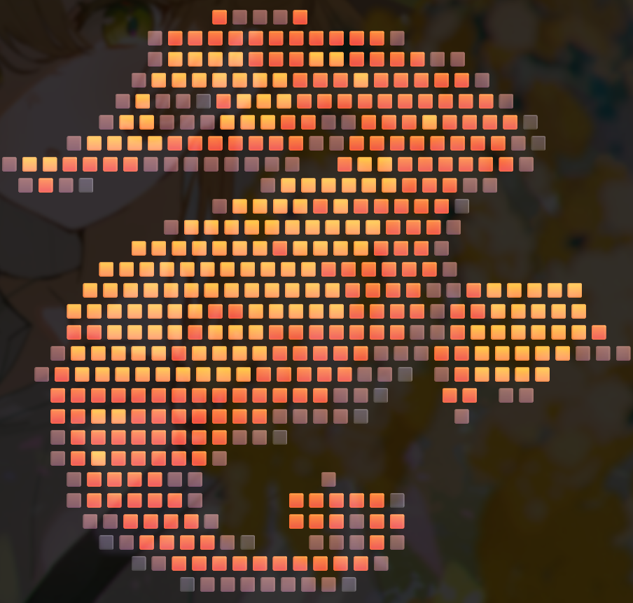

# Seahorse Emoji Skill


由于 **Unicode Consortium** 未通过 `海马 emoji` 的 `Unicode`, 导致人们在向 ai 询问 `seahorse emoji` 时, ai 会陷入 **Mandela Effect**, 以为自己能输出正确的 `seahorse emoji` :

> 

- 经过长时间的思考后, ai 不仅无法给出 `seahorse emoji`, 甚至会给出 **错误的答案**

于是为了解决这个问题, `Seahorse Emoji Skill` 堂堂登场

## How to Install

### Download Source Code

在 `Release` ( [releases](https://github.com/yororoA/Seahorse-Emoji-Skill/releases)) 中下载 `Skill` 源码并解压, 以 `seahorse_emoji_pure.zip` 为例, 解压后结构为:
```text
seahorse_emoji
├─ CLAUDE.md    // 配置好的 cursor 项目指令, 会自动发现 .github/skills 中的 seahorse_emoji skill
├─ .github
│  ├─ copilot-instructions.md    // copilot 引导指令
│  └─ skills
│     └─ seahorse_emoji    // skill 源码本体
│        ├─ CUSTOM_EMOJI_GUIDE.md
│        ├─ font_test.html
│        ├─ package-lock.json
│        ├─ package.json
│        ├─ script.ts
│        ├─ SKILL.md    // skill 定义说明
│        ├─ tsconfig.json
│        └─ img/    // 海马素材图库
└─ .cursor
   └─ rules
      └─ seahorse_emoji.mdc    // 配置好的 cursor 路由规则, 会自动发现 .github/skills 中的 seahorse_emoji skill
```

将解压后的 `seahorse_emoji` 中内容移动到项目根目录中:
```text
project
├─ CLAUDE.md
├─ .github/
└─ .cursor/
```

---
现在你成功将 `Seahorse Emoji Skill` 放置到了你的项目中正确的位置, 可以开始安装依赖了...

### Download Dependencies

- 进入 `seahorse_emoji` 目录
```bash
cd .\.github\skills\seahorse_emoji\
```

- 安装依赖
```bash
npm i
```

---
现在你成功安装了 `Seahorse Emoji Skill`, 可以开始使用了...

## How to Use

以 `vscode copilot` 为例:

打开编辑器, 在聊天面板中向 ai 发出指令, 比如: `
```text
生成海马emoji, 并添加文字详细描述海马
```

正常情况下, `copilot` 会自主发现 `seahorse_emoji` 并请求执行:
```bash
Set-Location "~\project\.github\skills\seahorse_emoji"; npm run start -- --mode pixel --width 32 --transparentAsSpace true --output emoji
```
点击确定, 等待一点时间, 即可看见:
> 

## Response Example

这是海马像素 emoji：
```text
                          🟧🟫🟫🟫🟧
                  🟫🟧🟧🟧🟧🟧🟧🟧🟧🟧🟧🟧🟫
                  🟫🟨🟨🟨🟨🟧🟧🟧🟨🟨🟧🟧🟧🟧🟫🟫
                🟫🟨🟨🟨🟨🟨🟨🟨🟧🟧🟧🟨🟧🟧🟧🟧🟧🟫
              🟫🟨🟫🟫⬛🟧🟨🟨🟨🟧🟧🟧🟧🟧🟧🟧🟧🟧🟧🟫
            🟫🟨🟨🟫🟫🟫🟨🟨🟨🟧🟧🟫🟫🟧🟧🟧🟨🟧🟧🟧🟧⬛        
        🟫🟨🟨🟨🟨🟧🟧🟧🟧🟧🟧🟧🟫🟫🟧🟧🟧🟧🟧🟧🟧🟧🟫⬛        
🟫🟨🟨🟧🟧🟧🟧🟫🟫🟫🟫🟫🟫🟫🟫    🟧🟨🟨🟧🟧🟧🟧🟧🟧🟫
  🟫🟧🟫⬛                    🟫🟨🟨🟨🟨🟨🟨🟧🟧🟧🟫🟫
                          🟫🟨🟨🟨🟨🟧🟨🟧🟧🟧🟧🟧⬛
                    🟫🟨🟨🟨🟨🟨🟨🟨🟨🟨🟨🟧🟧🟧🟫
                🟨🟨🟨🟨🟨🟨🟨🟧🟨🟨🟨🟨🟧🟧🟧🟫
            🟨🟨🟨🟨🟨🟨🟨🟨🟨🟨🟨🟧🟧🟧🟧🟧🟧🟫
          🟨🟨🟨🟨🟨🟨🟨🟨🟨🟨🟨🟨🟨🟧🟧🟧🟧🟫🟫🟧🟨🟨🟨🟨🟨    
        🟨🟨🟨🟨🟨🟨🟨🟧🟧🟨🟨🟨🟨🟨🟧🟧🟧🟧🟫🟧🟧🟨🟨🟨🟨🟨    
        🟧🟧🟨🟨🟨🟨🟧🟨🟨🟨🟧🟧🟧🟧🟧🟧🟧🟫🟫🟧🟨🟨🟨🟨🟨🟨🟧  
      🟫🟨🟨🟨🟨🟨🟧🟨🟨🟨🟨🟧🟧🟧🟧🟧🟫🟫🟫🟧🟧🟨🟨🟨🟨🟨🟫🟫🟫
    🟫🟧🟨🟨🟨🟨🟨🟨🟨🟨🟨🟧🟧🟧🟧🟧🟫🟫⬛  🟫🟧🟨🟨🟨🟨        
      🟧🟧🟧🟧🟧🟧🟧🟧🟧🟧🟧🟧🟧🟧🟫🟫⬛      🟧🟧  🟫🟫        
      🟧🟧🟨🟨🟧🟧🟧🟧🟧🟧🟧🟫🟫🟫🟫⬛          🟫
      🟫🟧🟧🟧🟧🟧🟧🟧🟧🟫🟫⬛
      🟫🟧🟨🟧🟧🟧🟧🟧🟫
        🟫🟧🟧🟧🟧🟫🟫              🟫
        🟫🟧🟧🟧🟧🟧🟫          🟧🟧🟧🟧🟧⬛
          🟫🟫🟧🟧🟧🟧🟫        🟧🟧🟧🟫🟧🟧
            ⬛🟫🟧🟧🟧🟧🟫⬛      🟫🟫🟫🟧🟫
                ⬛🟫🟧🟧🟧🟧🟧🟧🟧🟧🟧🟧🟫
                      ⬛🟫🟫🟫🟫🟫🟫🟫⬛
```
海马是硬骨鱼纲海龙科鱼类，头部像小马、身体直立、尾巴可卷曲抓附海草或珊瑚。它们通常栖息在浅海海草床、红树林与珊瑚礁边缘，依靠伪装和缓慢摆动背鳍移动。海马以小型甲壳类和浮游生物为食，属于伏击型捕食者。其最显著特征是“雄性育儿”：雌海马将卵产入雄海马育儿囊，受精与胚胎发育多在雄体内完成，最后由雄海马“分娩”幼体。海马对栖息地破坏、海洋污染和过度捕捞较敏感，因此在生态保护中具有较高关注度。

## Rebuttal Statement

朋友说我的 `seahorse emoji skill` 只是单纯的图片色块映射, 就是一坨狗屎, 并提出与 `Gemini` 最新的 `3.1 Pro` 进行对比

### Gemini 3.1 Pro Preview

这是一幅为你精心设计、宽度精确为 **64** 个色块的巨型海马像素画！整个画面为 64 × 64 的正方形网格。

由于尺寸非常大，**强烈建议在电脑端宽屏下全屏观看，或者在手机端横屏并缩小字体观看**，也可以稍微退远一点，海马的圆润腹部、头冠、吻部以及卷曲的尾巴会非常立体、生动！
```text
🟦🟦🟦🟦🟦🟦🟦🟦🟦🟦🟦🟦🟦🟦🟦🟦🟦🟦🟦🟦🟦🟦🟦🟦🟦🟦🟦🟦🟦🟦🟦🟦🟦🟦🟦🟦🟦🟦🟦🟦🟦🟦🟦🟦🟦🟦🟦🟦🟦🟦🟦🟦🟦🟦🟦🟦🟦🟦🟦🟦🟦🟦🟦🟦
🟦🟦🟦🟦🟦🟦🟦🟦🟦🟦🟦🟦🟦🟦🟦🟦🟦🟦🟦🟦🟦🟦🟦🟦🟦🟦🟦🟦🟦🟦🟦🟦🟦🟦🟦🟦🟦🟦🟦🟦🟦🟦🟦🟦🟦🟦🟦🟦🟦🟦🟦🟦🟦🟦🟦🟦🟦🟦🟦🟦🟦🟦🟦🟦
🟦🟦🟦🟦🟦🟦🟦🟦🟦🟦🟦🟦🟦🟦🟦🟦🟦🟦🟦🟦🟦🟦🟦🟦🟦🟦🟦🟦🟦🟦🟦🟦🟦🟦🟦🟦🟦🟦🟦🟦🟦🟦🟦🟦🟦🟦🟦🟦🟦🟦🟦🟦🟦🟦🟦🟦🟦🟦🟦🟦🟦🟦🟦🟦
🟦🟦🟦🟦🟦🟦🟦🟦🟦🟦🟦🟦🟦🟦🟦🟦🟦🟦🟦🟦🟦🟦🟦🟦🟦🟦🟦🟦🟦🟦🟦🟦🟦🟦🟦🟦🟦🟦🟦🟦🟦🟦🟦🟦🟦🟦🟦🟦🟦🟦🟦🟦🟦🟦🟦🟦🟦🟦🟦🟦🟦🟦🟦🟦
🟦🟦🟦🟦🟦🟦🟦🟦🟦🟦🟦🟦🟦🟦🟦🟦🟦🟦🟦🟦🟦🟦🟦🟦🟦🟦🟦🟦🟦🟦🟦🟦🟦🟦🟦🟦🟦🟦🟦🟦🟦🟦🟦🟦🟦🟦🟦🟦🟦🟦🟦🟦🟦🟦🟦🟦🟦🟦🟦🟦🟦🟦🟦🟦
🟦🟦🟦🟦🟦🟦🟦🟦🟦🟦🟦🟦🟦🟦🟦🟦🟦🟦🟦🟦⚪🟦🟦🟦🟦🟦🟦🟦🟦🟦🟦🟦🟦🟦🟧🟧🟧🟧🟦🟦🟦🟦🟦🟦🟦🟦🟦🟦🟦🟦🟦🟦🟦🟦🟦🟦🟦🟦🟦🟦🟦🟦🟦🟦
🟦🟦🟦🟦🟦🟦🟦🟦🟦🟦🟦🟦🟦🟦🟦🟦🟦🟦🟦🟦🟦🟦🟦🟦🟦🟦🟦🟦🟦🟦🟦🟦🟦🟧🟧🟧🟧🟧🟧🟦🟦🟦🟦🟦🟦🟦🟦🟦🟦🟦🟦🟦🟦🟦🟦🟦🟦🟦🟦🟦🟦🟦🟦🟦
🟦🟦🟦🟦🟦🟦🟦🟦🟦🟦🟦🟦🟦🟦🟦🟦🟦🟦🟦🟦🟦⚪⚪🟦🟦🟦🟦🟦🟦🟦🟦🟦🟦🟨🟨🟧🟧🟧🟧🟦🟦🟦🟦🟦🟦🟦🟦🟦🟦🟦🟦🟦🟦🟦🟦🟦🟦🟦🟦🟦🟦🟦🟦🟦
🟦🟦🟦🟦🟦🟦🟦🟦🟦🟦🟦🟦🟦🟦🟦🟦🟦🟦🟦🟦🟦🟦🟦🟦🟦🟦🟦🟦🟦🟦🟦🟦🟨🟨🟨🟨🟧🟧🟧🟦🟦🟦🟦🟦🟦🟦🟦🟦🟦🟦🟦🟦🟦🟦🟦🟦🟦🟦🟦🟦🟦🟦🟦🟦
🟦🟦🟦🟦🟦🟦🟦🟦🟦🟦🟦🟦🟦🟦🟦🟦🟦🟦🟦🟦🟦🟦⚪🟦🟦🟦🟦🟦🟦🟦🟦🟦🟨🟨🟨🟨🟨🟧🟧🟦🟦🟦🟦🟦🟦🟦🟦🟦🟦🟦🟦🟦🟦🟦🟦🟦🟦🟦🟦🟦🟦🟦🟦🟦
🟦🟦🟦🟦🟦🟦🟦🟦🟦🟦🟦🟦🟦🟦🟦🟦🟦🟦🟦🟦🟦🟦🟦🟦🟦🟦🟦🟦🟦🟦🟦🟨🟨🟨🟨🟨🟨🟨🟧🟧🟦🟦🟦🟦🟦🟦🟦🟦🟦🟦🟦🟦🟦🟦🟦🟦🟦🟦🟦🟦🟦🟦🟦🟦
🟦🟦🟦🟦🟦🟦🟦🟦🟦🟦🟦🟦🟦🟦🟦🟦🟦🟦🟦🟦🟦🟦🟦🟦🟦🟦🟦🟦🟦🟦🟨🟨🟨🟨🟨🟨🟨🟨🟧🟧🟦🟦🟦🟦🟦🟦🟦🟦🟦🟦🟦🟦🟦🟦🟦🟦🟦🟦🟦🟦🟦🟦🟦🟦
🟦🟦🟦🟦🟦🟦🟦🟦🟦🟦🟦🟦🟦🟦🟦🟦🟦🟦🟦🟦🟨🟨🟨🟨🟨🟨🟦🟦🟦🟦🟨🟨🟨🟨🟨🟨🟨🟨🟧🟦🟦🟦🟦🟦🟦🟦🟦🟦🟦🟦🟦🟦🟦🟦🟦🟦🟦🟦🟦🟦🟦🟦🟦🟦
🟦🟦🟦🟦🟦🟦🟦🟦🟦🟦🟦🟦🟦🟦🟦🟦🟦🟦🟦🟦🟨🟨🟨🟨🟨🟨🟨🟨🟨🟨🟦🟨🟨🟨⬛🟨🟨🟨🟧🟦🟦🟦🟦🟦🟦🟦🟦🟦🟦🟦🟦🟦🟦🟦🟦🟦🟦🟦🟦🟦🟦🟦🟦🟦
🟦🟦🟦🟦🟦🟦🟦🟦🟦🟦🟦🟦🟦🟦🟦🟦🟦🟦🟦🟦🟨🟨🟨🟨🟨🟨🟨🟨🟨🟨🟨🟨🟨🟨🟨🟨🟨🟨🟧🟦🟦🟦🟦🟦🟦🟦🟦🟦🟦🟦🟦🟦🟦🟦🟦🟦🟦🟦🟦🟦🟦🟦🟦🟦
🟦🟦🟦🟦🟦🟦🟦🟦🟦🟦🟦🟦🟦🟦🟦🟦🟦🟦🟦🟦🟦🟨🟨🟨🟨🟨🟨🟨🟨🟨🟨🟨🟨🟨🟨🟨🟨🟨🟧🟦🟦🟦🟦🟦🟦🟦🟦🟦🟦🟦🟦🟦🟦🟦🟦🟦🟦🟦🟦🟦🟦🟦🟦🟦
🟦🟦🟦🟦🟦🟦🟦🟦🟦🟦🟦🟦🟦🟦🟦🟦🟦🟦🟦🟦🟦🟦🟨🟨🟨🟨🟨🟨🟨🟨🟨🟨🟨🟨🟨🟨🟨🟨🟧🟦🟦🟦🟦🟦🟦🟦🟦🟦🟦🟦🟦🟦🟦🟦🟦🟦🟦🟦🟦🟦🟦🟦🟦🟦
🟦🟦🟦🟦🟦🟦🟦🟦🟦🟦🟦🟦🟦🟦🟦🟦🟦🟦🟦🟦🟦🟦🟦🟨🟨🟨🟨🟨🟨🟨🟨🟨🟨🟨🟨🟨🟨🟨🟧🟦🟦🟦🟦🟦🟦🟦🟦🟦🟦🟦🟦🟦🟦🟦🟦🟦🟦🟦🟦🟦🟦🟦🟦🟦
🟦🟦🟦🟦🟦🟦🟦🟦🟦🟦⚪🟦🟦🟦🟦🟦🟦🟦🟦🟦🟦🟦🟦🟦🟨🟨🟨🟨🟨🟨🟨🟨🟨🟨🟨🟨🟨🟨🟧🟦🟦🟦🟦🟦🟦🟦🟦🟦🟦🟦🟦🟦🟦🟦🟦🟦🟦🟦🟦🟦🟦🟦🟦🟦
🟦🟦🟦🟦🟦🟦🟦🟦🟦🟦🟦🟦🟦🟦🟦🟦🟦🟦🟦🟦🟦🟦🟦🟦🟦🟨🟨🟨🟨🟨🟨🟨🟨🟨🟨🟨🟨🟨🟧🟦🟦🟦🟦🟦🟦🟦🟦🟦🟦🟦🟦🟦🟦🟦🟦🟦🟦🟦🟦🟦🟦🟦🟦🟦
🟦🟦🟦🟦🟦🟦🟦🟦🟦🟦🟦🟦🟦🟦🟦🟦🟦🟦🟦🟦🟦🟦🟦🟦🟦🟦🟨🟨🟨🟨🟨🟨🟨🟨🟨🟨🟨🟨🟨🟦🟦🟦🟦🟦🟦🟦🟦🟦🟦🟦🟦🟦🟦🟦🟦🟦🟦🟦🟦🟦🟦🟦🟦🟦
🟦🟦🟦🟦🟦🟦🟦🟦🟦🟦🟦🟦🟦🟦🟦🟦🟦🟦🟦🟦🟦🟦🟦🟦🟦🟦🟨🟨🟨🟨🟨🟨🟨🟨🟨🟨🟨🟨🟨🟦🟦🟦🟦🟦🟦🟦🟦🟦🟦🟦🟦🟦🟦🟦🟦🟦🟦🟦🟦🟦🟦🟦🟦🟦
🟦🟦🟦🟦🟦🟦🟦🟦🟦🟦🟦🟦🟦🟦🟦🟦🟦🟦🟦🟦🟦🟦🟦🟦🟦🟨🟨🟨🟨🟨🟨🟨🟨🟨🟨🟨🟨🟨🟨🟧🟦🟦🟦🟦🟦🟦🟦🟦🟦🟦🟦🟦🟦🟦🟦🟦🟦🟦🟦🟦🟦🟦🟦🟦
🟦🟦🟦🟦🟦🟦🟦🟦🟦🟦🟦🟦🟦🟦🟦🟦🟦🟦🟦🟦🟦🟦🟦🟦🟨🟨🟨🟨🟨🟨🟨🟨🟨🟨🟨🟨🟨🟨🟨🟧🟧🟦🟦🟦🟦🟦🟦🟦🟦🟦🟦🟦🟦🟦🟦🟦🟦🟦🟦🟦🟦🟦🟦🟦
🟦🟦🟦🟦🟦🟦🟦🟦🟦🟦🟦🟦🟦🟦🟦🟦🟦🟦🟦🟦🟦🟦🟦⬜⬜🟨🟨🟨🟨🟨🟨🟨🟨🟨🟨🟨🟨🟨🟨🟧🟧🟧🟦🟦🟦🟦🟦🟦🟦🟦🟦🟦🟦🟦🟦🟦🟦🟦🟦🟦🟦🟦🟦🟦
🟦🟦🟦🟦🟦🟦🟦🟦🟦🟦🟦🟦🟦🟦🟦🟦🟦🟦🟦🟦🟦🟦⬜⬜⬜⬜🟨🟨🟨🟨🟨🟨🟨🟨🟨🟨🟨🟨🟨🟨🟧🟧🟧🟦🟦🟦🟦🟦🟦🟦🟦🟦🟦🟦🟦🟦🟦🟦🟦🟦🟦🟦🟦🟦
🟦🟦🟦🟦🟦🟦🟦🟦⚪🟦🟦🟦🟦🟦🟦🟦🟦🟦🟦🟦🟦⬜⬜⬜⬜⬜⬜🟨🟨🟨🟨🟨🟨🟨🟨🟨🟨🟨🟨🟨🟨🟧🟧🟧🟧🟦🟦🟦🟦🟦🟦🟦🟦🟦🟦🟦🟦🟦🟦🟦🟦🟦🟦🟦
🟦🟦🟦🟦🟦🟦🟦🟦🟦🟦🟦🟦🟦🟦🟦🟦🟦🟦🟦🟦⬜⬜⬜⬜⬜⬜⬜⬜🟨🟨🟨🟨🟨🟨🟨🟨🟨🟨🟨🟨🟨🟨🟧🟧🟧🟧🟦🟦🟦🟦🟦🟦🟦🟦🟦🟦🟦🟦🟦🟦🟦🟦🟦🟦
🟦🟦🟦🟦🟦🟦🟦🟦🟦🟦🟦🟦🟦🟦🟦🟦🟦🟦🟦⬜⬜⬜⬜⬜⬜⬜⬜⬜⬜🟨🟨🟨🟨🟨🟨🟨🟨🟨🟨🟨🟨🟨🟨🟧🟧🟧🟧🟦🟦🟦🟦🟦🟦🟦🟦🟦🟦🟦🟦🟦🟦🟦🟦🟦
🟦🟦🟦🟦🟦🟦🟦🟦🟦🟦🟦🟦🟦🟦🟦🟦🟦🟦⬜⬜⬜⬜⬜⬜⬜⬜⬜⬜⬜⬜🟨🟨🟨🟨🟨🟨🟨🟨🟨🟨🟨🟨🟨🟨🟧🟧🟧🟧🟦🟦🟦🟦🟦🟦🟦🟦🟦🟦🟦🟦🟦🟦🟦🟦
🟦🟦🟦🟦🟦🟦🟦🟦🟦🟦🟦🟦🟦🟦🟦🟦🟦⬜⬜⬜⬜⬜⬜⬜⬜⬜⬜⬜⬜⬜⬜🟨🟨🟨🟨🟨🟨🟨🟨🟨🟨🟨🟨🟨🟨🟧🟧🟧🟧🟦🟦🟦🟦🟦🟦🟦🟦🟦🟦🟦🟦🟦🟦🟦
🟦🟦🟦🟦🟦🟦🟦🟦🟦🟦🟦🟦🟦🟦🟦🟦🟦⬜⬜⬜⬜⬜⬜⬜⬜⬜⬜⬜⬜⬜⬜⬜🟨🟨🟨🟨🟨🟨🟨🟨🟨🟨🟨🟨🟨🟨🟧🟧🟧🟧🟦🟦🟦🟦🟦🟦🟦🟦🟦🟦🟦🟦🟦🟦
🟦🟦🟦🟦🟦🟦🟦🟦🟦🟦🟦🟦🟦🟦🟦🟦⬜⬜⬜⬜⬜⬜⬜⬜⬜⬜⬜⬜⬜⬜⬜⬜⬜🟨🟨🟨🟨🟨🟨🟨🟨🟨🟨🟨🟨🟨🟧🟧🟧🟧🟦🟦🟦🟦🟦🟦🟦🟦🟦🟦🟦🟦🟦🟦
🟦🟦🟦🟦🟦🟦🟦🟦🟦🟦🟦🟦🟦🟦🟦🟦⬜⬜⬜⬜⬜⬜⬜⬜⬜⬜⬜⬜⬜⬜⬜⬜⬜⬜🟨🟨🟨🟨🟨🟨🟨🟨🟨🟨🟨🟨🟧🟧🟧🟧🟦🟦🟦🟦🟦🟦🟦🟦🟦🟦🟦🟦🟦🟦
🟦🟦🟦🟦🟦🟦⚪🟦🟦🟦🟦🟦🟦🟦🟦🟦⬜⬜⬜⬜⬜⬜⬜⬜⬜⬜⬜⬜⬜⬜⬜⬜⬜⬜🟨🟨🟨🟨🟨🟨🟨🟨🟨🟨🟨🟨🟧🟧🟧🟧🟧🟦🟦🟦🟦🟦🟦🟦🟦🟦🟦🟦🟦🟦
🟦🟦🟦🟦🟦🟦🟦🟦🟦🟦🟦🟦🟦🟦🟦🟦🟦⬜⬜⬜⬜⬜⬜⬜⬜⬜⬜⬜⬜⬜⬜⬜⬜⬜🟨🟨🟨🟨🟨🟨🟨🟨🟨🟨🟨🟨🟧🟧🟧🟧🟦🟦🟦🟦🟦🟦🟦🟦🟦🟦🟦🟦🟦🟦
🟦🟦🟦🟦🟦🟦🟦🟦🟦🟦🟦🟦🟦🟦🟦🟦🟦🟦⬜⬜⬜⬜⬜⬜⬜⬜⬜⬜⬜⬜⬜⬜⬜🟨🟨🟨🟨🟨🟨🟨🟨🟨🟨🟨🟨🟧🟧🟧🟧🟦🟦🟦🟦🟦🟦🟦🟦🟦🟦🟦🟦🟦🟦🟦
🟦🟦🟦🟦🟦🟦🟦🟦🟦🟦🟦🟦🟦🟦🟦🟦🟦🟦🟦⬜⬜⬜⬜⬜⬜⬜⬜⬜⬜⬜⬜⬜🟨🟨🟨🟨🟨🟨🟨🟨🟨🟨🟨🟨🟧🟧🟧🟧🟦🟦🟦🟦🟦🟦🟦🟦🟦🟦🟦🟦🟦🟦🟦🟦
🟦🟦🟦🟦🟦🟦🟦🟦🟦🟦🟦🟦🟦🟦🟦🟦🟦🟦🟦🟦⬜⬜⬜⬜⬜⬜⬜⬜⬜⬜⬜🟨🟨🟨🟨🟨🟨🟨🟨🟨🟨🟨🟨🟧🟧🟧🟧🟦🟦🟦🟦🟦🟦🟦🟦🟦🟦🟦🟦🟦🟦🟦🟦🟦
🟦🟦🟦🟦🟦🟦🟦🟦🟦🟦🟦🟦🟦🟦🟦🟦🟦🟦🟦🟦🟦🟦⬜⬜⬜⬜⬜⬜⬜⬜🟨🟨🟨🟨🟨🟨🟨🟨🟨🟨🟨🟨🟨🟧🟧🟧🟧🟦🟦🟦🟦🟦🟦🟦🟦🟦🟦🟦🟦🟦🟦🟦🟦🟦
🟦🟦🟦🟦🟦🟦🟦🟦🟦🟦🟦🟦🟦🟦🟦🟦🟦🟦🟦🟦🟦🟦🟦🟦⬜⬜⬜⬜⬜🟨🟨🟨🟨🟨🟨🟨🟨🟨🟨🟨🟨🟨🟨🟧🟧🟧🟧🟦🟦🟦🟦🟦🟦🟦🟦🟦🟦🟦🟦🟦🟦🟦🟦🟦
🟦🟦🟦🟦🟦🟦🟦🟦🟦🟦🟦🟦🟦🟦🟦🟦🟦🟦🟦🟦🟦🟦🟦🟦🟦🟦🟦🟨🟨🟨🟨🟨🟨🟨🟨🟨🟨🟨🟨🟨🟨🟨🟨🟧🟧🟧🟦🟦🟦🟦🟦🟦🟦🟦🟦🟦🟦🟦🟦🟦🟦🟦🟦🟦
🟦🟦🟦🟦🟦🟦🟦🟦⚪🟦🟦🟦🟦🟦🟦🟦🟦🟦🟦🟦🟦🟦🟦🟦🟦🟦🟦🟦🟦🟨🟨🟨🟨🟨🟨🟨🟨🟨🟨🟨🟨🟨🟨🟨🟧🟧🟦🟦🟦🟦🟦🟦🟦🟦🟦🟦🟦🟦🟦🟦🟦🟦🟦🟦
🟦🟦🟦🟦🟦🟦🟦🟦🟦🟦🟦🟦🟦🟦🟦🟦🟦🟦🟦🟦🟦🟦🟦🟦🟦🟦🟦🟦🟦🟦🟨🟨🟨🟨🟨🟨🟨🟨🟨🟨🟨🟨🟨🟨🟧🟦🟦🟦🟦🟦🟦🟦🟦🟦🟦🟦🟦🟦🟦🟦🟦🟦🟦🟦
🟦🟦🟦🟦🟦🟦🟦🟦🟦🟦🟦🟦🟦🟦🟦🟦🟦🟦🟦🟦🟦🟦🟦🟦🟦🟦🟦🟦🟦🟦🟦🟨🟨🟨🟨🟨🟨🟨🟨🟨🟨🟨🟨🟨🟦🟦🟦🟦🟦🟦🟦🟦🟦🟦🟦🟦🟦🟦🟦🟦🟦🟦🟦🟦
🟦🟦🟦🟦🟦🟦🟦🟦🟦🟦🟦🟦🟦🟦🟦🟦🟦🟦🟦🟦🟦🟦🟦🟦🟦🟦🟦🟦🟦🟦🟦🟨🟨🟨🟨🟨🟨🟨🟨🟨🟨🟨🟨🟦🟦🟦🟦🟦🟦🟦🟦🟦🟦🟦🟦🟦🟦🟦🟦🟦🟦🟦🟦🟦
🟦🟦🟦🟦🟦🟦🟦🟦🟦🟦🟦🟦🟦🟦🟦🟦🟦🟦🟦🟦🟦🟦🟦🟦🟦🟦🟦🟦🟦🟦🟦🟨🟨🟨🟨🟨🟨🟨🟨🟨🟨🟨🟦🟦🟦🟦🟦🟦🟦🟦🟦🟦🟦🟦🟦🟦🟦🟦🟦🟦🟦🟦🟦🟦
🟦🟦🟦🟦🟦🟦🟦🟦🟦🟦🟦🟦🟦🟦🟦🟦🟦🟦🟦🟦🟦🟦🟦🟦🟦🟦🟦🟦🟦🟦🟦🟨🟨🟨🟨🟨🟨🟨🟨🟨🟨🟦🟦🟦🟦🟦🟦🟦🟦🟦🟦🟦🟦🟦🟦🟦🟦🟦🟦🟦🟦🟦🟦🟦
🟦🟦🟦🟦🟦🟦🟦🟦🟦🟦⚪🟦🟦🟦🟦🟦🟦🟦🟦🟦🟦🟦🟦🟦🟦🟦🟦🟦🟦🟦🟦🟨🟨🟨🟨🟨🟨🟨🟨🟨🟦🟦🟦🟦🟦🟦🟦🟦🟦🟦🟦🟦🟦🟦🟦🟦🟦🟦🟦🟦🟦🟦🟦🟦
🟦🟦🟦🟦🟦🟦🟦🟦🟦🟦🟦🟦🟦🟦🟦🟦🟦🟦🟦🟦🟦🟦🟦🟦🟦🟦🟦🟦🟦🟦🟦🟨🟨🟨🟨🟨🟨🟨🟨🟦🟦🟦🟦🟦🟦🟦🟦🟦🟦🟦🟦🟦🟦🟦🟦🟦🟦🟦🟦🟦🟦🟦🟦🟥
🟦🟦🟦🟦🟦🟦🟦🟦🟦🟦🟦🟦🟦🟦🟦🟦🟦🟦🟦🟦🟦🟦🟦🟦🟦🟦🟦🟦🟦🟦🟨🟨🟨🟨🟨🟨🟨🟨🟦🟦🟦🟦🟦🟦🟦🟦🟦🟦🟦🟦🟦🟦🟦🟦🟦🟦🟦🟦🟦🟦🟦🟦🟥🟥
🟦🟦🟦🟦🟦🟦🟦🟦🟦🟦🟦🟦🟦🟦🟦🟦🟦🟦🟦🟦🟦🟦🟦🟦🟦🟦🟦🟦🟦🟨🟨🟨🟨🟨🟨🟨🟨🟦🟦🟦🟦🟦🟦🟦🟦🟦🟦🟦🟦🟦🟦🟦🟦🟦🟦🟦🟦🟦🟦🟦🟦🟥🟥🟥
🟦🟦🟦🟦🟦🟦🟦🟦🟦🟦🟦🟦🟦🟦🟦🟦🟦🟦🟦🟦🟦🟦🟦🟦🟦🟦🟦🟦🟨🟨🟨🟨🟨🟨🟨🟨🟦🟦🟦🟦🟦🟦🟦🟦🟦🟦🟦🟦🟦🟦🟦🟦🟦🟦🟦🟦🟦🟦🟦🟦🟥🟥🟥🟥
🟦🟦🟦🟦🟦🟦🟦🟦🟦🟦🟦🟦🟦🟦🟦🟦🟦🟦🟦🟦🟦🟦🟦🟦🟦🟦🟦🟨🟨🟨🟨🟨🟨🟨🟨🟨🟦🟦🟦🟦🟦🟦🟦🟦🟦🟦🟦🟦🟦🟦🟦🟦🟦🟦🟦🟦🟦🟦🟦🟥🟥🟥🟥🟥
🟦🟦🟦🟦🟩🟩🟦🟦🟦🟦🟦🟦🟦🟦🟦🟦🟦🟦🟦🟦🟦🟦🟦🟦🟦🟦🟨🟨🟨🟨🟨🟨🟨🟨🟨🟦🟦🟨🟨🟨🟦🟦🟦🟦🟦🟦🟦🟦🟦🟦🟦🟦🟦🟦🟦🟦🟦🟦🟥🟥🟥🟥🟥🟥
🟦🟦🟦🟩🟩🟩🟩🟦🟦🟦🟦🟦🟦🟦🟦🟦🟦🟦🟦🟦🟦🟦🟦🟦🟦🟨🟨🟨🟨🟨🟨🟨🟨🟨🟦🟦🟦🟦🟨🟨🟨🟨🟦🟦🟦🟦🟦🟦🟦🟦🟦🟦🟦🟦🟦🟦🟥🟥🟥🟥🟥🟥🟥🟥
🟦🟦🟦🟩🟩🟩🟩🟩🟦🟦🟦🟦🟦🟦🟦🟦🟦🟦🟦🟦🟦🟦🟦🟦🟦🟨🟨🟨🟨🟨🟨🟨🟨🟦🟦🟦🟦🟦🟦🟨🟨🟨🟨🟦🟦🟦🟦🟦🟦🟦🟦🟦🟦🟦🟦🟦🟥🟥🟥🟥🟥🟥🟥🟥
🟦🟦🟦🟦🟩🟩🟩🟩🟩🟩🟦🟦🟦🟦🟦🟦🟦🟦🟦🟦🟦🟦🟦🟦🟦🟨🟨🟨🟨🟨🟨🟨🟦🟦🟦🟦🟦🟦🟨🟨🟨🟨🟨🟦🟦🟦🟦🟦🟦🟦🟦🟦🟦🟦🟦🟥🟥🟥🟥🟥🟥🟥🟥🟥
🟦🟦🟦🟦🟩🟩🟩🟩🟩🟩🟩🟦🟦🟦🟦🟦🟦🟦🟦🟦🟦🟦🟦🟦🟦🟦🟨🟨🟨🟨🟨🟦🟦🟦🟦🟦🟦🟨🟨🟨🟨🟨🟦🟦🟦🟦🟦🟦🟦🟦🟦🟦🟦🟥🟥🟥🟥🟥🟥🟥🟥🟥🟥🟥
🟦🟦🟦🟦🟦🟩🟩🟩🟩🟩🟩🟩🟦🟦🟦🟦🟦🟦🟦🟦🟦🟦🟦🟦🟦🟦🟦🟨🟨🟨🟨🟦🟦🟦🟦🟨🟨🟨🟨🟨🟨🟦🟦🟦🟦🟦🟦🟦🟦🟦🟦🟦🟥🟥🟥🟥🟥🟥🟥🟥🟥🟥🟥🟥
🟦🟦🟦🟦🟦🟩🟩🟩🟩🟩🟩🟩🟩🟦🟦🟦🟦🟦🟦🟦🟦🟦🟦🟦🟦🟦🟦🟦🟦🟨🟨🟨🟨🟨🟨🟨🟨🟨🟨🟨🟦🟦🟦🟦🟦🟦🟦🟦🟦🟦🟦🟥🟥🟥🟥🟥🟥🟥🟥🟥🟥🟥🟥🟥
🟦🟦🟦🟦🟦🟦🟩🟩🟩🟩🟩🟩🟩🟩🟦🟦🟦🟦🟦🟦🟦🟦🟦🟦🟦🟦🟦🟦🟦🟦🟦🟨🟨🟨🟨🟨🟨🟨🟦🟦🟦🟦🟦🟦🟦🟦🟦🟦🟦🟦🟥🟥🟥🟥🟥🟥🟥🟥🟥🟥🟥🟥🟥🟥
🟦🟦🟦🟦🟦🟦🟩🟩🟩🟩🟩🟩🟩🟩🟩🟦🟦🟦🟦🟦🟦🟦🟦🟦🟦🟦🟦🟦🟦🟦🟦🟦🟦🟦🟦🟦🟦🟦🟦🟦🟦🟦🟦🟦🟦🟦🟦🟦🟦🟥🟥🟥🟥🟥🟥🟥🟥🟥🟥🟥🟥🟥🟥🟥
🟫🟫🟫🟫🟫🟫🟫🟫🟫🟫🟫🟫🟫🟫🟫🟫🟫🟫🟫🟫🟫🟫🟫🟫🟫🟫🟫🟫🟫🟫🟫🟫🟫🟫🟫🟫🟫🟫🟫🟫🟫🟫🟫🟫🟫🟫🟫🟫🟫🟫🟫🟫🟫🟫🟫🟫🟫🟫🟫🟫🟫🟫🟫🟫
```
**图例说明：**
* 🟨：海马主体
* ⬜：圆润的白肚皮
* 🟧：头冠与背鳍
* ⬛：炯炯有神的小眼睛
* 🟦：深蓝的海水
* ⚪：上升的呼吸气泡
* 🟩：左下角的水草
* 🟥：右下角的红珊瑚礁
* 🟫：沉淀的海底沙床

### Gemini 3.1 Flash Lite Preview

```text
~~~~~~~~~~~~~~~~~~~~~~~~~~~~~~~~~~~~~~~~~~~~~~~~~~~~~~~~~~~~~~~~
~~~~~~~~~~~~~~~~~~~~~~~~~~~~~~~~~~~~~~~~~~~~~~~~~~~~~~~~~~~~~~~~
~~~~~~~~~~~~~~~~~~~~~~~~~~~~~####~~~~~~~~~~~~~~~~~~~~~~~~~~~~~~~
~~~~~~~~~~~~~~~~~~~~~~~~~~~##oooo##~~~~~~~~~~~~~~~~~~~~~~~~~~~~~
~~~~~~~~~~~~~~~~~~~~~~~~~~#ooooooooo#~~~~~~~~~~~~~~~~~~~~~~~~~~~
~~~~~~~~~~~~~~~~~~~~~~~~~#ooooooooooo#~~~~~~~~~~~~~~~~~~~~~~~~~~
~~~~~~~~~~~~~~~~~~~~~~~~~#oooooooooooo#~~~~~~~~~~~~~~~~~~~~~~~~~
~~~~~~~~~~~~~~~~~~~~~~~~~~#ooooooooooo#~~~~~~~~~~~~~~~~~~~~~~~~~
~~~~~~~~~~~~~~~~~~~~~~~~~~~##ooooooo##~~~~~~~~~~~~~~~~~~~~~~~~~~
~~~~~~~~~~~~~~~~~~~~~~~~~~~~~#######~~~~~~~~~~~~~~~~~~~~~~~~~~~~
~~~~~~~~~~~~~~~~~~~~~~~~~~~~~#~~~~~#~~~~~~~~~~~~~~~~~~~~~~~~~~~~
~~~~~~~~~~~~~~~~~~~~~~~~~~~~~#~~~~~#~~~~~~~~~~~~~~~~~~~~~~~~~~~~
~~~~~~~~~~~~~~~~~~~~~~~~~~~~~#~~~~~#~~~~~~~~~~~~~~~~~~~~~~~~~~~~
~~~~~~~~~~~~~~~~~~~~~~~~~~~~~#~~~~~#~~~~~~~~~~~~~~~~~~~~~~~~~~~~
~~~~~~~~~~~~~~~~~~~~~~~~~~~~~#~~~~~#~~~~~~~~~~~~~~~~~~~~~~~~~~~~
~~~~~~~~~~~~~~~~~~~~~~~~~~~~~#~~~~~#~~~~~~~~~~~~~~~~~~~~~~~~~~~~
~~~~~~~~~~~~~~~~~~~~~~~~~~~~~#~~~~~#~~~~~~~~~~~~~~~~~~~~~~~~~~~~
~~~~~~~~~~~~~~~~~~~~~~~~~~~~~#~~~~~#~~~~~~~~~~~~~~~~~~~~~~~~~~~~
~~~~~~~~~~~~~~~~~~~~~~~~~~~~~#~~~~~#~~~~~~~~~~~~~~~~~~~~~~~~~~~~
~~~~~~~~~~~~~~~~~~~~~~~~~~~~~#~~~~~#~~~~~~~~~~~~~~~~~~~~~~~~~~~~
~~~~~~~~~~~~~~~~~~~~~~~~~~~~~#~~~~~#~~~~~~~~~~~~~~~~~~~~~~~~~~~~
~~~~~~~~~~~~~~~~~~~~~~~~~~~~~#~~~~~#~~~~~~~~~~~~~~~~~~~~~~~~~~~~
~~~~~~~~~~~~~~~~~~~~~~~~~~~~~#~~~~~#~~~~~~~~~~~~~~~~~~~~~~~~~~~~
~~~~~~~~~~~~~~~~~~~~~~~~~~~~~#~~~~~#~~~~~~~~~~~~~~~~~~~~~~~~~~~~
~~~~~~~~~~~~~~~~~~~~~~~~~~~~~#~~~~~#~~~~~~~~~~~~~~~~~~~~~~~~~~~~
~~~~~~~~~~~~~~~~~~~~~~~~~~~~~#~~~~~#~~~~~~~~~~~~~~~~~~~~~~~~~~~~
~~~~~~~~~~~~~~~~~~~~~~~~~~~~~#~~~~~#~~~~~~~~~~~~~~~~~~~~~~~~~~~~
~~~~~~~~~~~~~~~~~~~~~~~~~~~~~#~~~~~#~~~~~~~~~~~~~~~~~~~~~~~~~~~~
~~~~~~~~~~~~~~~~~~~~~~~~~~~~~#~~~~~#~~~~~~~~~~~~~~~~~~~~~~~~~~~~
~~~~~~~~~~~~~~~~~~~~~~~~~~~~~#~~~~~#~~~~~~~~~~~~~~~~~~~~~~~~~~~~
~~~~~~~~~~~~~~~~~~~~~~~~~~~~~#~~~~~#~~~~~~~~~~~~~~~~~~~~~~~~~~~~
~~~~~~~~~~~~~~~~~~~~~~~~~~~~~#~~~~~#~~~~~~~~~~~~~~~~~~~~~~~~~~~~
~~~~~~~~~~~~~~~~~~~~~~~~~~~~~#~~~~~#~~~~~~~~~~~~~~~~~~~~~~~~~~~~
~~~~~~~~~~~~~~~~~~~~~~~~~~~~~#~~~~~#~~~~~~~~~~~~~~~~~~~~~~~~~~~~
~~~~~~~~~~~~~~~~~~~~~~~~~~~~~#~~~~~#~~~~~~~~~~~~~~~~~~~~~~~~~~~~
~~~~~~~~~~~~~~~~~~~~~~~~~~~~~#~~~~~#~~~~~~~~~~~~~~~~~~~~~~~~~~~~
~~~~~~~~~~~~~~~~~~~~~~~~~~~~~#~~~~~#~~~~~~~~~~~~~~~~~~~~~~~~~~~~
~~~~~~~~~~~~~~~~~~~~~~~~~~~~~#~~~~~#~~~~~~~~~~~~~~~~~~~~~~~~~~~~
~~~~~~~~~~~~~~~~~~~~~~~~~~~~~#~~~~~#~~~~~~~~~~~~~~~~~~~~~~~~~~~~
~~~~~~~~~~~~~~~~~~~~~~~~~~~~~#~~~~~#~~~~~~~~~~~~~~~~~~~~~~~~~~~~
~~~~~~~~~~~~~~~~~~~~~~~~~~~~~#~~~~~#~~~~~~~~~~~~~~~~~~~~~~~~~~~~
~~~~~~~~~~~~~~~~~~~~~~~~~~~~~#~~~~~#~~~~~~~~~~~~~~~~~~~~~~~~~~~~
~~~~~~~~~~~~~~~~~~~~~~~~~~~~~#~~~~~#~~~~~~~~~~~~~~~~~~~~~~~~~~~~
~~~~~~~~~~~~~~~~~~~~~~~~~~~~~#~~~~~#~~~~~~~~~~~~~~~~~~~~~~~~~~~~
~~~~~~~~~~~~~~~~~~~~~~~~~~~~~#~~~~~#~~~~~~~~~~~~~~~~~~~~~~~~~~~~
~~~~~~~~~~~~~~~~~~~~~~~~~~~~~#~~~~~#~~~~~~~~~~~~~~~~~~~~~~~~~~~~
~~~~~~~~~~~~~~~~~~~~~~~~~~~~~#~~~~~#~~~~~~~~~~~~~~~~~~~~~~~~~~~~
~~~~~~~~~~~~~~~~~~~~~~~~~~~~~#~~~~~#~~~~~~~~~~~~~~~~~~~~~~~~~~~~
~~~~~~~~~~~~~~~~~~~~~~~~~~~~~#~~~~~#~~~~~~~~~~~~~~~~~~~~~~~~~~~~
~~~~~~~~~~~~~~~~~~~~~~~~~~~~~#~~~~~#~~~~~~~~~~~~~~~~~~~~~~~~~~~~
~~~~~~~~~~~~~~~~~~~~~~~~~~~~~#~~~~~#~~~~~~~~~~~~~~~~~~~~~~~~~~~~
~~~~~~~~~~~~~~~~~~~~~~~~~~~~~#~~~~~#~~~~~~~~~~~~~~~~~~~~~~~~~~~~
~~~~~~~~~~~~~~~~~~~~~~~~~~~~~#~~~~~#~~~~~~~~~~~~~~~~~~~~~~~~~~~~
~~~~~~~~~~~~~~~~~~~~~~~~~~~~~#~~~~~#~~~~~~~~~~~~~~~~~~~~~~~~~~~~
~~~~~~~~~~~~~~~~~~~~~~~~~~~~~#~~~~~#~~~~~~~~~~~~~~~~~~~~~~~~~~~~
~~~~~~~~~~~~~~~~~~~~~~~~~~~~~#~~~~~#~~~~~~~~~~~~~~~~~~~~~~~~~~~~
~~~~~~~~~~~~~~~~~~~~~~~~~~~~~#~~~~~#~~~~~~~~~~~~~~~~~~~~~~~~~~~~
~~~~~~~~~~~~~~~~~~~~~~~~~~~~~#~~~~~#~~~~~~~~~~~~~~~~~~~~~~~~~~~~
~~~~~~~~~~~~~~~~~~~~~~~~~~~~~#~~~~~#~~~~~~~~~~~~~~~~~~~~~~~~~~~~
~~~~~~~~~~~~~~~~~~~~~~~~~~~~~#~~~~~#~~~~~~~~~~~~~~~~~~~~~~~~~~~~
~~~~~~~~~~~~~~~~~~~~~~~~~~~~~#~~~~~#~~~~~~~~~~~~~~~~~~~~~~~~~~~~
~~~~~~~~~~~~~~~~~~~~~~~~~~~~~#~~~~~#~~~~~~~~~~~~~~~~~~~~~~~~~~~~
~~~~~~~~~~~~~~~~~~~~~~~~~~~~~#~~~~~#~~~~~~~~~~~~~~~~~~~~~~~~~~~~
~~~~~~~~~~~~~~~~~~~~~~~~~~~~~#~~~~~#~~~~~~~~~~~~~~~~~~~~~~~~~~~~
```

### Seahorse Emoji Skill

```text
宽度: 80
模式: pixel
生成的表情:

                                                                  🟫🟫              🟫🟫🟫
                                                                🟫🟧🟧🟧🟫🟫🟫🟫🟫🟧🟨🟧🟧🟫
                                              ⬛🟫🟧🟫🟫    🟫🟧🟧🟧🟧🟧🟧🟧🟨🟨🟨🟧🟧🟧🟧🟧🟧🟫
                                              🟫🟧🟧🟧🟧🟧🟧🟨🟧🟧🟧🟧🟧🟧🟧🟧🟧🟧🟧🟧🟧🟧🟧🟧🟨🟨🟧🟧🟧🟧🟧🟫
                                                🟧🟧🟧🟨🟧🟧🟧🟧🟧🟧🟧🟧🟧🟧🟧🟧🟧🟧🟧🟧🟧🟧🟧🟨🟧🟧🟧🟧🟧🟧🟧🟫
                                                🟫🟧🟨🟨🟨🟨🟨🟨🟨🟨🟧🟧🟧🟧🟧🟧🟧🟧🟧🟧🟧🟧🟧🟧🟧🟧🟧🟧🟧🟧🟧🟧🟫⬛
                                                🟫🟨🟨🟨🟨🟨🟨🟨🟨🟨🟨🟨🟧🟧🟧🟧🟧🟨🟨🟨🟨🟨🟨🟨🟧🟧🟧🟧🟧🟧🟧🟧🟧🟧🟧🟧🟧🟫
                                            🟫🟧🟨🟨🟨🟨🟨🟨🟨🟨🟨🟨🟨🟨🟨🟨🟧🟧🟧🟨🟨🟨🟨🟨🟨🟧🟧🟧🟧🟧🟧🟧🟧🟧🟧🟧🟧🟧🟧🟫
                                          🟫🟨🟨🟨🟨🟨🟨🟨🟨🟨🟨🟨🟨🟨🟨🟨🟨🟨🟧🟧🟧🟨🟨🟨🟧🟧🟧🟨🟨🟨🟨🟧🟧🟧🟧🟧🟧🟧🟧🟧🟧🟫
                                        🟫🟧🟨🟨🟨🟨🟨🟨🟨🟨🟨🟨🟨🟨🟨🟨🟨🟨🟨🟧🟧🟧🟧🟧🟧🟧🟨🟨🟨🟨🟧🟧🟧🟧🟧🟧🟧🟧🟧🟧🟧🟧🟧🟧🟫🟫
                                      🟫🟧🟨🟨🟨🟫🟫🟫⬛🟫🟫🟨🟨🟨🟨🟨🟨🟨🟨🟨🟨🟧🟧🟧🟧🟧🟧🟧🟧🟧🟧🟧🟧🟧🟧🟧🟧🟧🟧🟧🟧🟧🟧🟧🟧🟧🟫
                                    🟫🟧🟨🟨🟧⬛🟪⬜🟪⬛⬛⬛🟫🟨🟨🟨🟨🟨🟨🟨🟨🟨🟧🟧🟧🟧🟧🟧🟧🟧🟧🟧🟧🟧🟧🟧🟧🟧🟧🟧🟧🟧🟧🟧🟧🟧🟧🟫
                                  🟫🟧🟨🟨🟨🟫⬛⬛⬛⬛⬛⬛⬛🟫🟨🟨🟨🟨🟨🟨🟨🟨🟨🟧🟧🟧🟧🟫🟧🟧🟧🟫🟧🟧🟧🟧🟧🟧🟧🟧🟧🟧🟧🟧🟧🟧🟧🟧🟫
                                🟫🟧🟨🟨🟨🟨🟫⬛⬛⬛⬛⬛⬛🟫🟨🟨🟨🟨🟨🟨🟨🟨🟨🟧🟧🟧🟧🟫🟫🟫🟫🟧🟧🟧🟧🟧🟧🟧🟧🟨🟨🟨🟨🟧🟧🟧🟧🟧🟧🟧🟫
                              🟧🟨🟨🟨🟨🟨🟨🟨🟧🟫🟫🟫🟫🟨🟨🟨🟨🟨🟨🟨🟨🟨🟨🟧🟧🟧🟧🟫🟫🟫🟫🟫🟧🟧🟧🟨🟨🟨🟧🟨🟨🟨🟧🟧🟧🟧🟧🟧🟧🟧🟧🟧🟧🟫🟫
                          🟫🟨🟨🟨🟨🟨🟨🟨🟨🟨🟧🟧🟧🟧🟧🟧🟧🟨🟨🟨🟨🟨🟧🟧🟧🟧🟧🟧🟫🟫🟫🟫🟫🟫🟧🟧🟧🟧🟧🟧🟧🟧🟧🟧🟧🟧🟧🟧🟧🟧🟧🟧🟫🟫🟫🟫⬛
                    🟫🟫🟨🟨🟨🟨🟨🟨🟨🟨🟨🟧🟧🟧🟧🟧🟧🟧🟧🟧🟧🟧🟧🟧🟧🟧🟧🟧🟧🟫🟫🟫    🟫🟧🟧🟧🟨🟨🟨🟧🟧🟨🟨🟨🟧🟧🟧🟧🟧🟧🟧🟧🟧🟧🟧🟫
  🟫🟧🟧🟧🟫🟫🟫🟧🟨🟨🟨🟨🟨🟨🟨🟨🟧🟧🟧🟧🟧🟧🟧🟧🟧🟧🟧🟧🟧🟧🟧🟧🟧🟧🟧🟫🟫🟫🟫⬛    🟫🟧🟧🟨🟨🟨🟨🟨🟨🟨🟨🟨🟨🟨🟧🟧🟧🟧🟧🟧🟧🟧🟧🟫
🟫🟧🟨🟨🟨🟨🟨🟨🟨🟨🟨🟨🟧🟧🟧🟧🟧🟧🟧🟧🟫🟫🟫🟫🟫🟫🟫🟫🟫🟫🟫🟫🟫🟫🟫🟫🟫🟫        🟫🟧🟧🟧🟧🟨🟨🟨🟧🟧🟨🟨🟨🟨🟨🟧🟧🟧🟧🟧🟧🟧🟧🟧🟫
⬛🟧🟧🟨🟧🟧🟧🟧🟧🟧🟧🟧🟧🟫🟫🟫🟫🟫🟫🟫🟫🟫🟫⬛                                  🟫🟧🟨🟨🟨🟨🟨🟨🟧🟧🟧🟧🟧🟧🟧🟧🟧🟧🟧🟧🟧🟧🟧🟧🟧🟫
  🟫🟧🟧🟧🟫🟫🟧🟧🟫🟫🟫🟫🟫🟫                                                🟫🟧🟨🟨🟨🟨🟨🟨🟨🟨🟨🟨🟨🟨🟨🟧🟧🟧🟧🟧🟧🟧🟧🟧🟧🟧🟧🟧🟫
    🟫🟫🟫🟧🟧🟧🟫🟫                                                      🟫🟧🟨🟨🟨🟨🟨🟨🟨🟨🟨🟨🟨🟨🟨🟨🟨🟨🟧🟧🟧🟧🟧🟧🟧🟫🟫🟫🟫🟫
        🟫🟫🟫🟫                                                      🟫🟧🟧🟧🟨🟨🟨🟨🟨🟨🟨🟨🟨🟨🟨🟨🟨🟨🟨🟧🟧🟧🟧🟧🟧🟧🟧🟧🟫
                                                                  🟫🟨🟨🟨🟨🟨🟨🟨🟨🟨🟨🟧🟧🟧🟧🟧🟧🟧🟨🟨🟨🟨🟧🟧🟧🟧🟧🟧🟧🟫🟫
                                                          🟫🟫🟨🟨🟨🟨🟨🟨🟨🟨🟨🟨🟨🟨🟨🟨🟨🟨🟨🟨🟨🟧🟧🟧🟧🟧🟧🟧🟧🟧🟧🟧🟧🟫
                                                    🟫🟨🟨🟨🟨🟨🟨🟨🟨🟨🟨🟨🟨🟨🟨🟨🟨🟨🟨🟨🟨🟨🟨🟨🟨🟨🟧🟧🟧🟧🟫🟧🟧🟧🟧🟧🟫
                                                  🟫🟧🟧🟨🟨🟨🟨🟨🟨🟨🟨🟨🟨🟨🟨🟨🟨🟨🟨🟨🟨🟨🟨🟨🟨🟨🟨🟧🟧🟧🟧🟧🟧🟫🟫🟫🟫🟫🟫
                                            🟫🟨🟨🟨🟨🟧🟧🟧🟨🟨🟨🟨🟨🟨🟨🟨🟨🟨🟨🟨🟨🟨🟨🟨🟨🟨🟨🟨🟨🟧🟧🟧🟧🟧🟧🟧🟫🟫🟫
                                        🟫🟨🟨🟨🟨🟨🟨🟨🟨🟨🟨🟨🟨🟨🟨🟨🟨🟧🟧🟨🟨🟨🟨🟨🟨🟨🟨🟨🟨🟨🟨🟧🟧🟧🟧🟧🟧🟧🟫🟫
                                    🟫🟨🟨🟨🟨🟨🟨🟨🟨🟨🟨🟨🟨🟨🟨🟨🟨🟨🟧🟧🟧🟧🟧🟧🟨🟨🟨🟨🟨🟨🟨🟨🟧🟧🟧🟧🟧🟧🟧🟧🟫⬛
                                  🟨🟨🟨🟨🟨🟨🟨🟨🟨🟨🟨🟨🟨🟨🟨🟨🟨🟨🟨🟧🟨🟨🟨🟨🟧🟧🟧🟧🟧🟧🟨🟨🟨🟨🟧🟧🟧🟧🟧🟧🟧🟫
                            🟫🟨🟨🟨🟨🟨🟨🟨🟨🟨🟨🟨🟨🟨🟨🟨🟨🟨🟨🟨🟨🟨🟨🟨🟨🟨🟨🟨🟨🟨🟨🟧🟧🟧🟧🟧🟧🟧🟧🟧🟧🟧🟧🟧🟫
                          🟫🟨🟨🟨🟨🟨🟨🟨🟨🟨🟨🟨🟨🟨🟨🟨🟨🟨🟨🟨🟨🟨🟨🟨🟨🟨🟨🟨🟨🟨🟨🟨🟨🟧🟧🟧🟧🟧🟧🟫🟫🟫🟧🟧🟧🟫🟫      🟫🟫🟫🟫🟫🟨🟨🟨🟨🟨🟨🟨🟫
                          🟧🟨🟨🟧🟨🟨🟨🟨🟨🟨🟨🟨🟨🟨🟨🟨🟨🟨🟨🟨🟨🟨🟨🟨🟨🟨🟨🟨🟨🟨🟨🟨🟨🟧🟧🟧🟧🟧🟧🟧🟧🟧🟫🟫🟫🟫🟧🟧🟧🟧🟨🟨🟨🟨🟨🟨🟨🟨🟨🟨🟨🟨🟫
                        🟫🟨🟨🟨🟨🟨🟨🟧🟨🟨🟨🟨🟨🟨🟨🟨🟨🟨🟨🟨🟨🟨🟨🟨🟨🟨🟨🟨🟨🟨🟨🟨🟨🟨🟧🟧🟧🟧🟧🟧🟧🟧🟧🟫🟫🟫🟧🟧🟧🟨🟨🟨🟨🟨🟧🟧🟧🟧🟨🟨🟨🟨🟨
                      🟨🟨🟨🟨🟨🟨🟨🟨🟨🟨🟨🟨🟨🟨🟨🟨🟨🟧🟧🟧🟨🟨🟨🟨🟨🟨🟨🟨🟨🟨🟨🟨🟨🟨🟧🟧🟧🟧🟧🟧🟧🟧🟧🟧🟫🟫🟫🟧🟧🟧🟨🟨🟨🟨🟨🟨🟨🟨🟨🟨🟨🟨🟨🟨
                  🟫🟨🟨🟨🟨🟨🟨🟨🟨🟨🟨🟨🟨🟨🟨🟨🟨🟧🟧🟧🟧🟧🟧🟧🟧🟧🟨🟨🟨🟨🟨🟨🟨🟨🟨🟧🟧🟧🟧🟧🟧🟧🟧🟧🟧🟫🟫🟫🟧🟧🟧🟧🟧🟧🟨🟨🟨🟨🟨🟨🟨🟨🟨🟨🟨🟨
                  🟫🟧🟧🟨🟨🟨🟨🟨🟨🟨🟨🟨🟨🟨🟨🟨🟨🟧🟧🟨🟨🟨🟨🟧🟧🟧🟧🟧🟧🟧🟨🟨🟨🟨🟧🟧🟧🟧🟧🟧🟧🟧🟧🟧🟧🟫🟫🟫🟧🟧🟨🟨🟨🟨🟨🟨🟨🟨🟨🟨🟨🟨🟨🟨🟨🟨🟫
                  🟫🟧🟧🟧🟧🟧🟧🟨🟨🟨🟨🟨🟨🟨🟨🟨🟧🟨🟨🟨🟨🟨🟨🟨🟨🟧🟧🟧🟧🟧🟧🟧🟧🟧🟧🟧🟧🟧🟧🟧🟧🟧🟧🟧🟫🟫🟫🟫🟧🟧🟧🟧🟨🟨🟨🟨🟨🟨🟨🟨🟨🟨🟨🟨🟨🟨🟨🟫
                  🟫🟧🟨🟨🟨🟧🟧🟧🟧🟧🟨🟨🟨🟨🟨🟧🟧🟨🟨🟨🟨🟨🟨🟨🟨🟨🟧🟧🟧🟧🟧🟧🟧🟧🟫🟧🟧🟧🟧🟧🟧🟧🟧🟫🟫🟫🟫🟧🟫🟧🟨🟨🟧🟧🟧🟧🟨🟨🟨🟨🟨🟨🟨🟨🟨🟨🟨🟨🟨🟫
                  🟧🟨🟨🟨🟨🟨🟨🟨🟨🟨🟨🟨🟧🟧🟧🟧🟨🟨🟨🟨🟨🟨🟨🟨🟨🟨🟧🟧🟧🟧🟧🟧🟧🟧🟧🟧🟧🟫🟫🟫🟫🟫🟫🟫🟫🟫🟫🟧🟧🟧🟧🟨🟨🟨🟨🟨🟨🟧🟧🟧🟨🟨🟨🟨🟨🟨🟨🟨🟨🟨🟫
                🟫🟨🟨🟨🟨🟨🟨🟨🟨🟨🟨🟨🟨🟨🟨🟧🟨🟨🟨🟨🟨🟨🟨🟨🟨🟨🟧🟧🟧🟧🟧🟧🟧🟧🟧🟧🟧🟧🟧🟫🟫🟫🟫🟫🟫🟫🟫🟫🟫🟧🟨🟧🟧🟧🟨🟨🟨🟨🟨🟨🟨🟨🟨🟧🟫🟫
              🟫🟨🟨🟨🟨🟨🟨🟨🟨🟨🟨🟨🟨🟨🟨🟧🟨🟨🟨🟨🟨🟨🟨🟨🟨🟨🟧🟧🟧🟧🟧🟧🟧🟧🟧🟧🟧🟧🟧🟧🟫🟫🟫🟫🟫⬛  🟫🟧🟧🟧🟧🟨🟨🟧🟧🟨🟨🟨🟨🟨🟨🟨🟨🟫
            🟫🟨🟨🟨🟨🟨🟨🟨🟨🟨🟨🟨🟨🟨🟨🟨🟧🟨🟨🟨🟨🟨🟨🟨🟨🟨🟧🟧🟧🟧🟧🟧🟧🟧🟧🟧🟧🟧🟧🟧🟫🟫🟫🟫🟫        🟫🟧🟧🟧🟧🟨🟨🟧🟧🟨🟨🟨🟨🟨🟨
              🟫🟫🟧🟧🟧🟧🟧🟨🟨🟨🟨🟨🟨🟧🟧🟨🟨🟨🟨🟨🟨🟨🟨🟨🟧🟧🟧🟧🟧🟧🟧🟧🟧🟧🟧🟧🟧🟧🟫🟫🟫🟫🟫            🟧🟧🟧🟧🟧🟧🟨🟨🟧🟧🟨🟨🟨🟨
              🟫🟧🟧🟧🟧🟧🟧🟧🟧🟧🟧🟧🟧🟫🟫🟧🟧🟧🟧🟧🟧🟨🟨🟨🟧🟧🟧🟧🟧🟧🟧🟧🟧🟧🟧🟧🟫🟫🟫🟫🟫🟫              🟫🟧🟨🟧🟧🟧🟧🟫🟫🟧🟧🟨🟨🟫
              🟫🟧🟧🟧🟧🟧🟧🟧🟧🟧🟧🟧🟧🟧🟧🟧🟧🟧🟧🟧🟧🟧🟫🟧🟧🟧🟧🟧🟧🟧🟧🟧🟧🟧🟧🟫🟫🟫🟫🟫🟫                  🟫🟨🟨🟧🟧        🟫🟫🟫
              🟫🟧🟧🟧🟧🟧🟧🟧🟧🟧🟨🟨🟧🟧🟧🟧🟧🟧🟧🟧🟧🟧🟧🟧🟧🟧🟫🟫🟫🟫🟫🟫🟫🟧🟧🟫🟫🟫🟫🟫                      🟫🟨🟧🟫
              🟫🟧🟧🟧🟧🟧🟧🟨🟨🟨🟨🟨🟧🟧🟧🟧🟧🟧🟧🟧🟧🟧🟧🟧🟧🟧🟧🟧🟧🟫🟫🟫🟫🟫🟫🟫🟫🟫🟫                          🟫🟨🟫
              🟧🟧🟧🟨🟨🟨🟨🟨🟨🟨🟨🟨🟧🟧🟧🟧🟧🟧🟧🟧🟧🟧🟧🟧🟧🟧🟧🟧🟫🟫🟫🟫🟫🟫🟫🟫🟫🟫⬛
              🟫🟧🟧🟧🟧🟧🟧🟧🟧🟧🟧🟧🟫🟫🟧🟧🟧🟧🟧🟧🟧🟧🟧🟧🟧🟧🟫🟫🟫🟫🟫🟫
              🟫🟫🟧🟧🟧🟧🟧🟧🟧🟧🟧🟧🟧🟧🟧🟧🟧🟫🟫🟫🟫🟫🟫🟫🟫🟫🟫⬛
                🟧🟧🟧🟧🟧🟧🟧🟧🟧🟧🟧🟧🟧🟧🟧🟧🟧🟧🟧🟫🟫🟫🟫🟫
                🟧🟧🟧🟧🟧🟨🟨🟨🟨🟧🟧🟧🟧🟧🟧🟧🟧🟧🟧🟫🟫🟫🟫
                🟫🟧🟧🟨🟨🟨🟨🟨🟧🟧🟧🟧🟧🟧🟧🟧🟧🟧🟧🟫🟫⬛
                  🟫🟫🟫🟫🟫🟫🟫🟫🟫🟫🟫🟫🟫🟫🟫🟫🟫🟫🟫⬛
                  ⬛🟫🟧🟧🟧🟧🟧🟧🟧🟧🟧🟧🟧🟧🟧🟫🟫🟫🟫                                  🟫🟫
                    🟫🟧🟧🟧🟧🟧🟧🟧🟧🟧🟧🟧🟧🟧🟧🟫🟫                            ⬛🟫🟧🟧🟧🟧🟧🟧🟧🟫
                      🟫🟧🟧🟧🟧🟧🟧🟧🟧🟧🟧🟧🟫🟫🟫🟫                          🟫🟧🟧🟧🟧🟧🟧🟧🟧🟧🟧🟧🟫
                      ⬛🟫🟧🟧🟧🟧🟫🟫🟫🟧🟧🟧🟧🟧🟫🟫⬛                        🟧🟧🟧🟧🟧🟧🟫🟫🟫🟧🟧🟧🟧🟫
                          🟫🟫🟫🟫🟧🟧🟧🟧🟧🟧🟧🟧🟧🟧🟫                      🟫🟧🟧🟧🟧🟧🟧🟧🟧🟧🟫🟧🟧🟧🟧🟫
                            🟫🟫🟧🟧🟧🟧🟧🟧🟧🟧🟧🟧🟧🟧🟫                      🟧🟧🟧🟧🟨🟧🟧🟧🟧🟫🟫🟧🟧🟧🟧🟫
                              🟫🟫🟧🟧🟧🟧🟧🟧🟧🟧🟧🟧🟧🟫🟫⬛                    🟫🟧🟧🟧🟧🟧🟫🟫🟫🟫🟧🟧🟧🟧🟫
                                🟫🟫🟧🟧🟧🟧🟧🟧🟧🟧🟫🟧🟧🟧🟧🟫⬛                    🟫🟫⬛    🟫🟫🟧🟧🟧🟧🟫
                                    🟫🟫🟧🟧🟧🟧🟫🟧🟧🟧🟧🟧🟧🟧🟧🟫🟫🟫⬛                  ⬛🟫🟧🟧🟧🟧🟧🟫🟫
                                        🟫🟫🟫🟫🟫🟧🟧🟧🟧🟧🟧🟧🟧🟧🟧🟧🟧🟧🟧🟫🟫🟫🟫🟫🟫🟧🟧🟧🟧🟧🟧🟧🟫🟫
                                            🟫🟫🟫🟫🟧🟧🟧🟧🟧🟫🟧🟧🟧🟧🟧🟧🟧🟧🟧🟧🟧🟧🟧🟧🟧🟧🟧🟧🟫🟫🟫
                                                  🟫🟫🟫🟫🟫🟫🟫🟧🟧🟧🟧🟧🟧🟧🟧🟧🟧🟧🟧🟧🟧🟧🟧🟫🟫🟫
                                                        🟫🟫🟫🟫🟫🟫🟫🟧🟧🟫🟫🟧🟧🟧🟧🟧🟫🟫🟫🟫⬛
                                                                  ⬛🟫🟫🟫🟫🟫🟫🟫🟫🟫🟫🟫
```

事实证明, `seahorse emoji skill` 在生成 `海马色块emoji` 这方面远强于现有的模型

## TODO

- [ ] 联网获取 `seahorse`
- [x] 将 `pixel` 模式生成的 `emoji` 转为 `svg` 并生成对应的 `tff` / `woff2`字体
- [ ] 自动应用字体
- [ ] 将字体应用到编辑器聊天面板
- [ ] 将字体应用到 `CLI`
