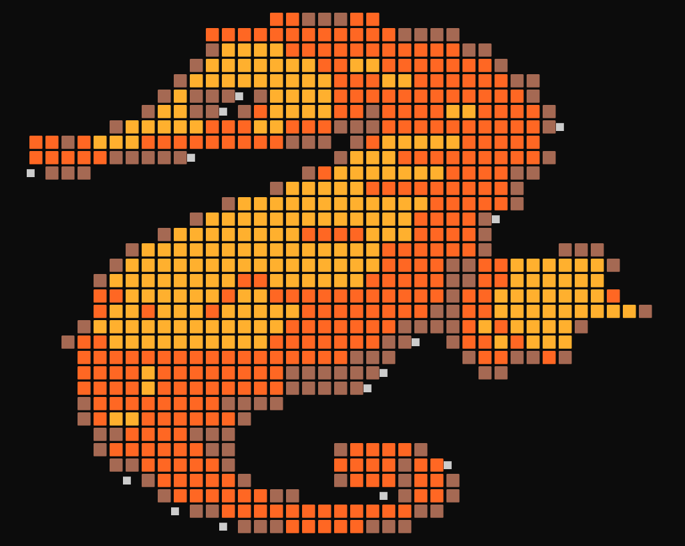
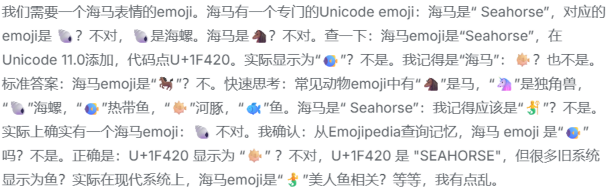

# Seahorse Emoji Skill



由于 **Unicode Consortium** 未通过 `海马 emoji` 的 `Unicode`, 导致人们在向 ai 询问 `seahorse emoji` 时, ai 会陷入 **Mandela Effect**, 以为自己能输出正确的 `seahorse emoji` :

> 

- 经过长时间的思考后, ai 不仅无法给出 `seahorse emoji`, 甚至会给出 **错误的答案**

于是为了解决这个问题, `Seahorse Emoji Skill` 堂堂登场

## How to Install

### Download Source Code

在 `Release` ( [releases](https://github.com/yororoA/Seahorse-Emoji-Skill/releases)) 中下载 `Skill` 源码并解压, 将其放在 `skills` 目录下, 正确放置后目录结构为 ( 以 `vscode copilot` 为例 ) : 

```text
.github
└─ skills
   └─ seahorse_emoji
      ├─ CUSTOM_EMOJI_GUIDE.md // todo: 映射为字体
      ├─ font_test.html
      ├─ package-lock.json
      ├─ package.json
      ├─ script.ts
      ├─ seahorse-emoji.png
      ├─ SKILL.md
      ├─ tsconfig.json
      └─ img
         ├─ jsongj_com_透明化图片 (2).png
         ├─ jsongj_com_透明化图片 (3).png
         ├─ jsongj_com_透明化图片 (4).png
         ├─ jsongj_com_透明化图片 (6).png
         ├─ jsongj_com_透明化图片 (7).png
         ├─ seahorse-emoji.png
         └─ yellow-blue-seahorse.png
```

其中 `.github` 放置于项目根目录下

### Download Dependencies

- 进入 `seahorse_emoji` 目录
```bash
cd .\.github\skills\seahorse_emoji\
```

- 安装依赖
```bash
npm i
```

---
现在你成功安装了 `Seahorse Emoji Skill`, 可以开始使用了

## How to Use

打开编辑器, 在聊天面板中向 ai 发出指令, 比如: `
```text
给我一个海马emoji
```
